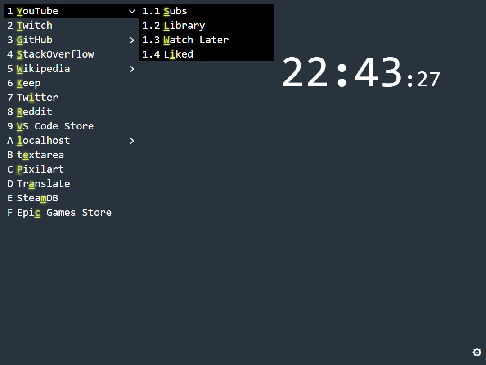

# What's this?

newtab is a simple start page for the browser.



# What is special

A hotkey is automatically set for **each** link

✨ Added interface for tabs management

## Multilevel

You can set sublinks to links, which in one way or another will complement the parent link

For example:

```
[{
    name: `YouTube`,
    url: `https://youtube.com`,
    sub: [
        {
            after: `/feed/subscriptions`,
            name: `Subs`,
        },
        {
            after: `/feed/library`,
            name: `Library`,
        },
        {
            after: `/playlist?list=WL`,
            name: `Watch Later`,
        },
        {
            after: `/playlist?list=LL`,
            name: `Liked`,
        },
    ],
},
{
    name: `Twitch`,
    url: `https://twitch.tv`,
},
{
    name: `Wikipedia`,
    url: `https://en.wikipedia.org`,
    sub: [
        {
            before: `https://uk`,
            name: `UA`,
            sliceStart: 10,
        },
    ],
},
...
```

result:

```
1. YouTube              # https://youtube.com
    1.1 Subs            # https://youtube.com/feed/subscriptions
    1.2 Library         # https://youtube.com/feed/library
    1.3 Watch Later     # https://youtube.com/playlist?list=WL
    1.4 Liked           # https://youtube.com/playlist?list=LL
2. Twitch               # https://twitch.tv
3. Wikipedia            # https://en.wikipedia.org
    3.1 UA              # https://uk.wikipedia.org
...
```

Or use ✨ new interface for tabs management

You can disable hotkey for the link if you set `key` field `#`
